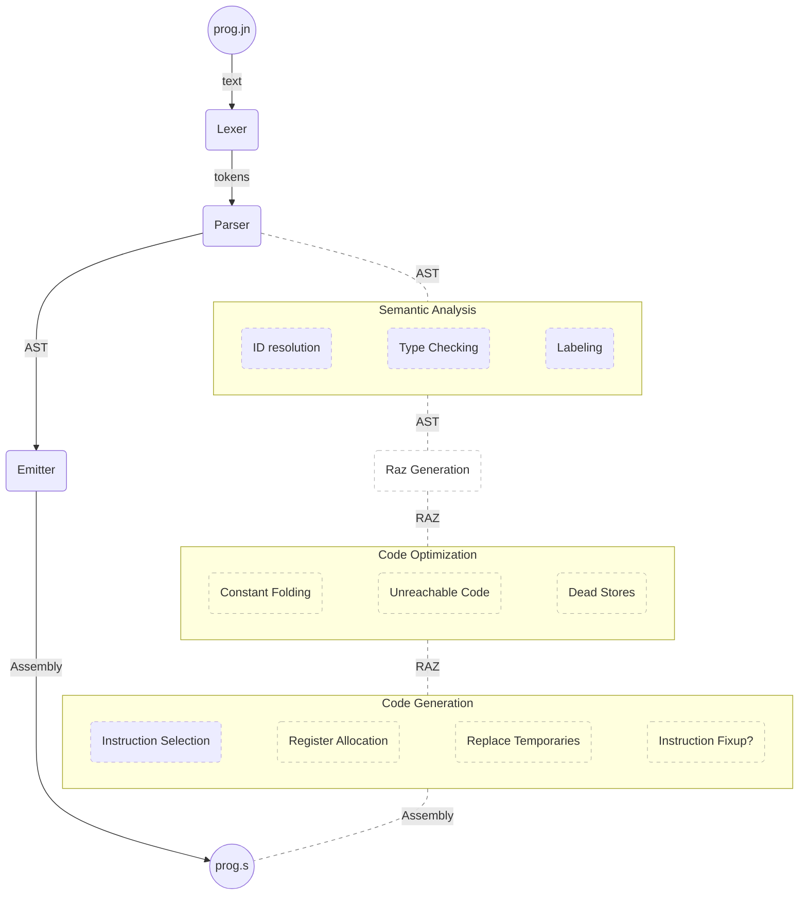

# Development Status

## Language Features

- [x] `fn` / `return` constructs
- [x] `if` / `while` constructs
- [x] arbitrary variable names
- [x] read/write global variables
- [x] compound expressions with precedence
- [x] address-of and dereference operators
- [x] function pointers
- [x] structs
- [ ] typechecking
- [x] array indexing
- [ ] array types
- [ ] blocks/scopes
- [x] unconstrained local variables
- [ ] unconstrained parameter passing (and varargs?)
- [ ] logical operators
- [x] shift operators
- [ ] non-shift bitwise operators
- [ ] conditional/ternary operator
- [ ] `+=` and friends
- [ ] implicit types in declarations
- [ ] methods
- [ ] `const` support
- [ ] compound literals
- [ ] traits
- [ ] forward declarations
- [ ] import/include
- [ ] automatic memory management
- [ ] `for` loops/iterators
- [ ] `enum` support

## Library Features

- [x] buffered StdOut & `printf`
- [x] tree-based symbol table
- [x] string builder type
- [x] dynamic memory recycling
- [x] array-backed list type
- [ ] balanced tree-based symbol table
- [x] sorting arrays
- [ ] buffered StdIn & StdErr
- [ ] read/write files
- [ ] regular expressions
- [x] hash-based symbol table
- [x] a queue data type
- [ ] binary search of arrays

## Compilation Stages

Below is a sketch of the compiler's current state (green), along with a sketch of the target structure (gray). Initially, it emitted straight from the parts of the token stream it recognized, ignoring the rest, and relying on the programmer to ensure referenced symbols would resolve.

